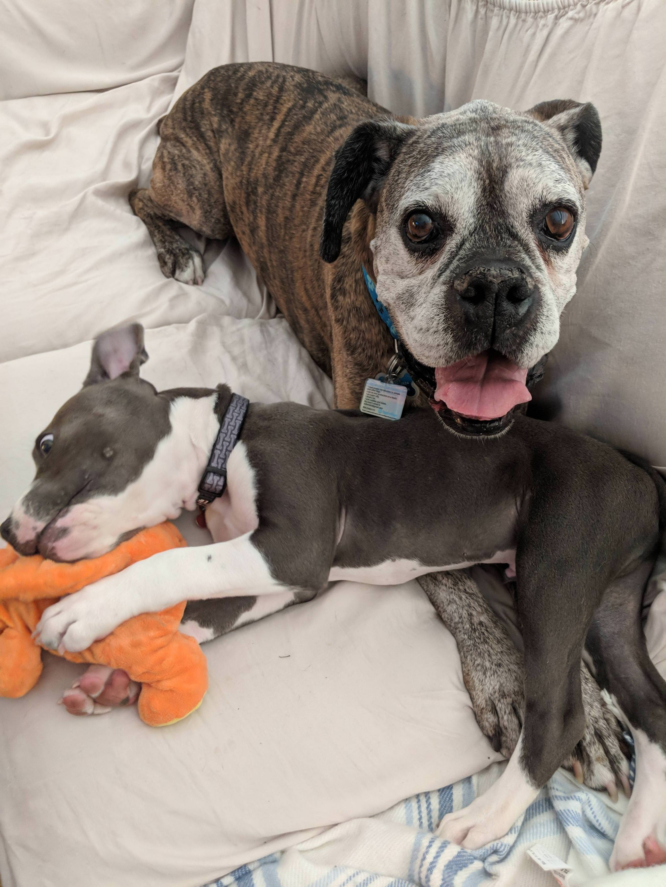
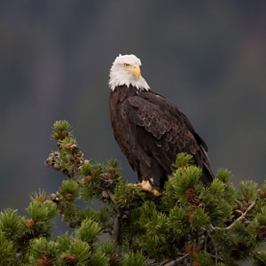
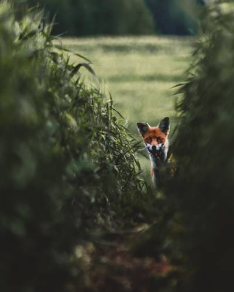
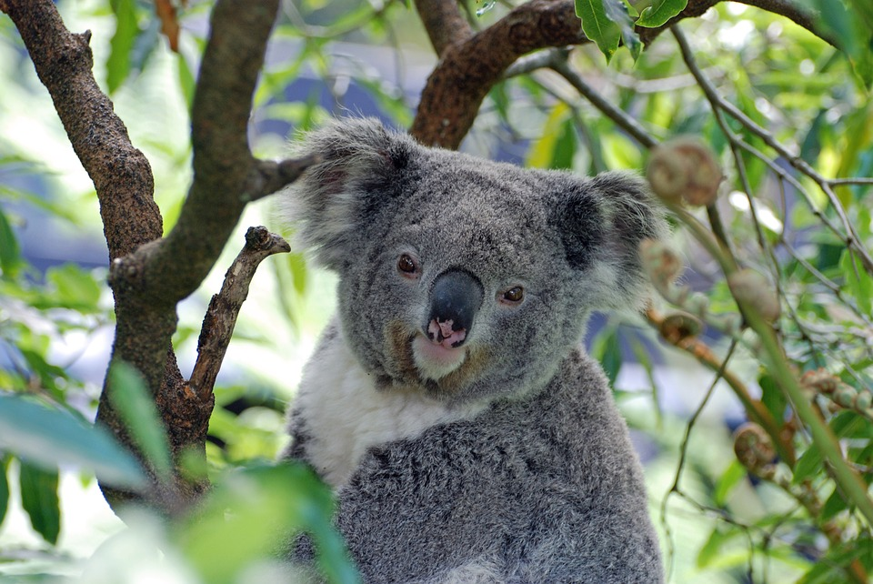
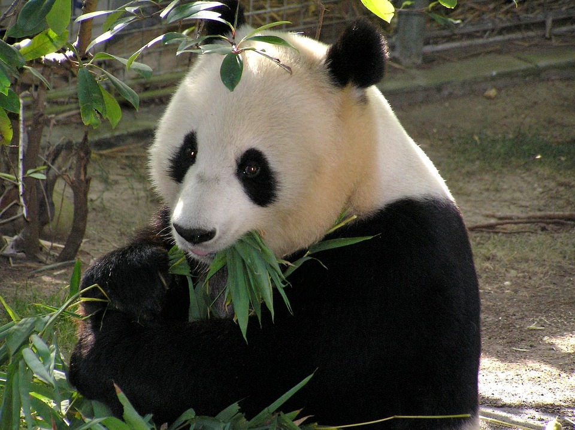

# Commands

Table of contents
  * [Animals](#Animals)
    * [Cat](#Cat)
    * [Dog](#Dog)
    * [Bird](#Bird)
    * [Fox](#Fox)
    * [Koala](#Koala)
    * [Panda](#Panda)

# Animals 

## Cat

Sends a `MessageEmbed` including an image of a cat and a fact. Note that the fact may not match the image since they come from 2 seperate sources.

Example cat fact: *"Cats have a lower social IQ than dogs but can solve more difficult cognitive problems when they feel like it."*

---

## Dog

Sends a `MessageEmbed` including an image of a dog and a fact. Note that the fact may not match the image since they come from 2 seperate sources.

Example dog fact: *"Dogs have two times the amount of muscles in their ears than humans."*

---

## Bird

Sends a `MessageEmbed` including an image of a bird and a fact. Note that the fact may not match the image since they come from 2 seperate sources.

Example bird fact: *"Kiwis are endangered, flightless birds that live in New Zealand. They lay the largest eggs relative to their body size of any bird in the world."*

---

## Fox

Sends a `MessageEmbed` including an image of a fox and a fact. Note that the fact may not match the image since they come from 2 seperate sources.

Example fox fact: *""Some foxes can hear objects that are 40 yards (36.5 meters) away.""*

---

## Koala

Sends a `MessageEmbed` including an image of a koala and a fact. Note that the fact may not match the image since they come from 2 seperate sources.

Example koala fact: *""These magnificent mammals get their name form an Aboriginal term meaning, "no drink". It’s believed this is because koalas get almost all their moisture from the leaves they eat, and rarely drink water.""*

---

## Panda

Sends a `MessageEmbed` including an image of a panda and a fact. Note that the fact may not match the image since they come from 2 seperate sources.

Example panda fact: *"Pandas are pigeon-toed; in other words, they walk with their front paws turned inward."*
